# Budget To-Do List (this porject using closures pattern) Step I:

`1. Add event handler`

`2. Get input values`

`3. Add the new item to our data structure`

`4. Add the new item to the UI`

`5. Calculate budget`

`5. Update the UI`

---
- in app.js, using IIFE pattern
```js
var budgetController = (function () {
    var x = 23;
    var add = function (a) {
        return x + a;
    }

    return {
        publicTest: function (b) {
            console.log(add(b));
        }
    }
})();

/* output: 
budgetController.x
undefined

budgetController.add(5)
Uncaught TypeError: budgetController.add is not a function

budgetController.publicTest(5)
28
*/
```
`Let's analyze what happens here:`
- This varaible var x and function add are declared.
- Then, return an object, which, contatins the method that we called publicTest, but it could have a lot of methods not just only publicTest. So this object is what we get assigned to the budget variable after this function returns. 
- Because of Closures, any other function has always access to the variables and parameters of its outer function even after the outer function has returned. 
- Therefore, publicTest function that we return here will always have access to the x variable and the add function because a closure was created here. That's why we say that the publicTest method is public because it was returned and now we can use it. But the x and add variables are private because they are in the closure and therefore only the publicTest method can access them.
- To conclude, all of this works due to closures to these functions and this x variable are in the closure. Even after this IIFE here has returned.    


`the further Closures' mechanism is explained in` [let and const Scope](https://github.com/NovemberFall/javaScript_Sytnax/blob/master/letConstES6.md) && [Closures](https://github.com/NovemberFall/javaScript_Sytnax/blob/master/Closures.md)

# create an User Interface Controller
```js
var UIController = (function () {
    // Some code
})();
```

-We have created two modules and by now are completely independent modules. There will not be any interaction between these two ever. Because we want them to be as stand alone, as independent as possible.

-For example, imagine that if you ever wanted to create a more complex budget app but a completely different User Interface, you can take the budget controller module and then expand it and not think about the User Interface at all. Because the User Interface is separated from the data,they  don't communicate at all. And that is called **separation of concerns**, which, basically means that each part of the application should only be interested in doing one thing independently.

-Overall, these two controllers don't know about each other. They are standing alone, they don't even know that the other one exists. 

## Now we need some way to have these two connected. That's why we create a third module which is the app controller.
we update the app.js :
```js
var budgetController = (function () {
    var x = 23;
    var add = function (a) {
        return x + a;
    }

    return {
        publicTest: function (b) {
            return add(b);
        }
    }
})();

var UIController = (function () {
    // Some code

})();

var controller = (function (budgetCtrl, UICtrl) {
    var val = budgetCtrl.publicTest(5);
    return {
        anotherPublic: function () {
            console.log(val);
        }
    }
})(budgetController, UIController);

/* 
Input: controller.anotherPublic();
Ouput: 28
*/
```

# Setting up the First Event Listener
`Clean some codes`

```js
// Budget Controller
var budgetController = (function () {

})();

// UI Controller
var UIController = (function () {
    // Some code

})();

// Global App Controller
var controller = (function (budgetCtrl, UICtrl) {
    document.querySelector('.add__btn').addEventListener('click', function () {
        // 1. Get the filed input data
        // 2. Add the item to the budget controller
        // 3. Add the item to the UI
        // 4. Calculate the budget
        // 5. Display the budget on the UI
    });
    document.addEventListener('keypress', function (event) {
        console.log(event);
    });
})(budgetController, UIController);
```
`If we press the 'Enter' key`
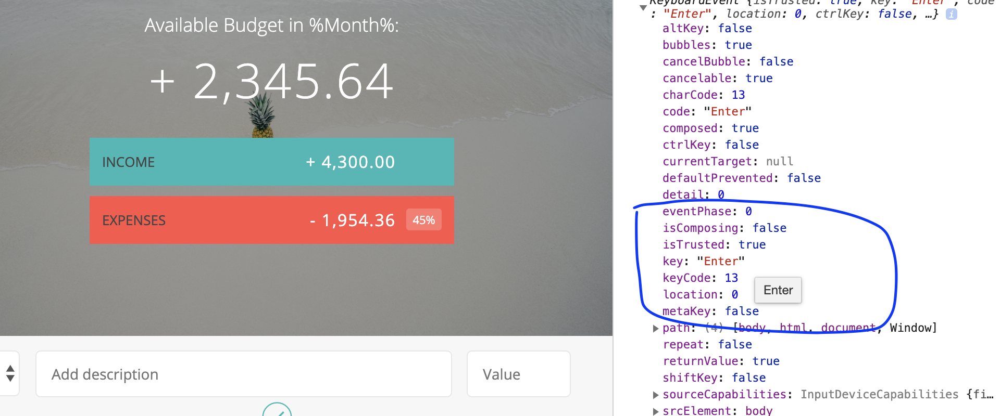

`Now, we can listen the keyboard envent, when the key ENTER is pressed`
```js
    document.addEventListener('keypress', function (event) {
        if (event.keyCode === 13 || event.which === 13) {
            console.log("ENTER was pressed.")
        }
    });
//The output is same as the last photo
```

- button listener event
```js
    var ctrlAddItem = function () {
        // 1. Get the filed input data
        // 2. Add the item to the budget controller
        // 3. Add the item to the UI
        // 4. Calculate the budget
        // 5. Display the budget on the UI
        console.log("It was working.");
    }
    document.querySelector('.add__btn').addEventListener('click', ctrlAddItem);
```


# Reading input data
`now we need to read select's input's value`
```js
// UI Controller
var UIController = (function () {
    return {
        getInput: function () {
            var type = document.querySelector('add__type').value; //will be either inc or exp
            var description = document.getElementsByClassName('add__description')[0].value;
            var value = document.getElementsByClassName('add__value')[0].value;
        }
    };
})();
```
- but the problem is we should return a object, so we altering the codes
```js
var UIController = (function () {
    return {
        getInput: function () {
            return {
                type: document.querySelector('.add__type').value, //will be either inc or exp
                description: document.getElementsByClassName('add__description')[0].value,
                value: document.getElementsByClassName('add__value')[0].value
            };
        }
    };
})();
```
`altering ctrlAddItem()`
```js
    var ctrlAddItem = function () {
        // 1. Get the filed input data
        var input = UIController.getInput();
        console.log(input);
    }
```
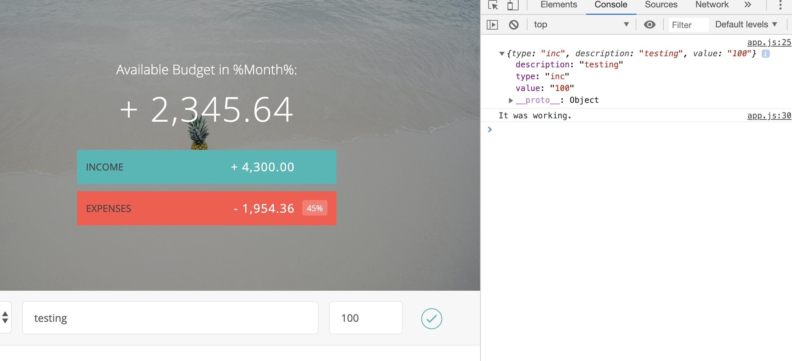

`but that's a problem because imagine that we make some changes in the UI and class names and then we would have to change all of these strings manually.`
- So instead we can simply create an object where we store all of this data.

- we can create a private variable:
```js
var UIController = (function () {
    var DOMstring = {
        inputType: '.add__type',
        inputDescription: 'add__description',
        inputValue: 'add__value'
    };

    return {
        getInput: function () {
            return {
                type: document.querySelector(DOMstring.inputType).value, //will be either inc or exp
                description: document.getElementsByClassName(DOMstring.inputDescription)[0].value,
                value: document.getElementsByClassName(DOMstring.inputValue)[0].value
            };
        },

        getDOMstrings: function () {
            return DOMstrings;
        }
    };
})();
```
`adding a getDOMstrings into the public; in the controller,define a new variable to get the DOMstrings`
```js
var DOM = UICtrl.getDOMstrings();
```
`Now look at this hard codes:`
```js
 document.querySelector('.add__btn').addEventListener('click', ctrlAddItem);
```
`we should avoid this, adding a btn`
```js
    var DOMstrings = {
        inputType: '.add__type',
        inputDescription: 'add__description',
        inputValue: 'add__value',
        inputBtn: '.add__btn'
    };
```
```js
document.querySelector(DOM.inputBtn).addEventListener('click', ctrlAddItem);
```
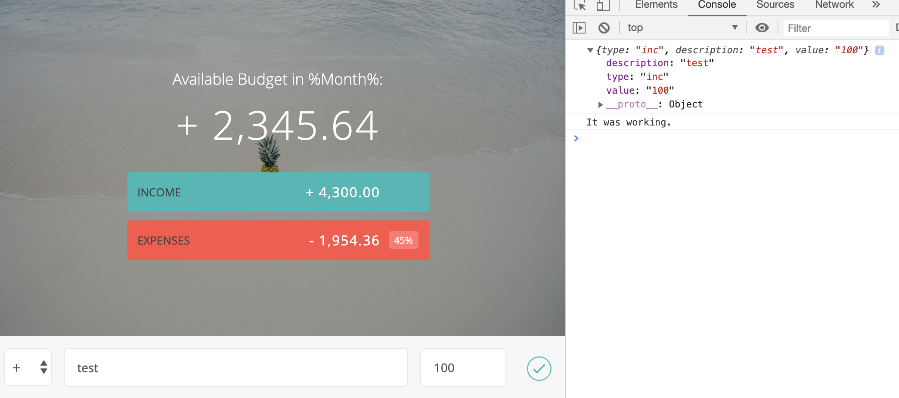

- Now we are encapsulating two function 
```js
    document.querySelector(DOM.inputBtn).addEventListener('click', ctrlAddItem);
    document.addEventListener('keypress', function (event) {});
```
- inside controller
```js
    var setupEventListeners = function(){
        var DOM = UICtrl.getDOMstrings();
        
        document.querySelector(DOM.inputBtn).addEventListener('click', ctrlAddItem);

        document.addEventListener('keypress', function (event) {
            if (event.keyCode === 13 || event.which === 13) {
                ctrlAddItem();
            }
        });
    };
```

`we want to create a public initialization function, which called init inside controller`

```js
    return {
        init: function(){
            console.log('Application has statred.');
            setupEventListeners();
        }
    };
```
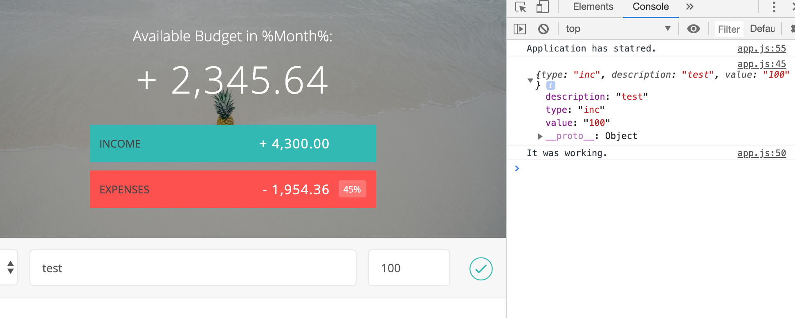


# Creating Income and Expense Function Constructors:

- create a good data structure
- the user would input 10 incomes
- so we would create 10 income objects
- creat an array to store these objects 
```js
// Budget Controller
var budgetController = (function () {
    var Expense = function (id, description, value) {
        this.id = id;
        this.description = description;
        this.value = value;
    };
    var Income = function (id, description, value) {
        this.id = id;
        this.description = description;
        this.value = value;
    };

    var data = {
        allItems: {
            exp: [],
            inc: []
        },
        totals: {
            exp: 0,
            inc: 0
        }
    }
})();
```
---


# updating all functions
`The newest version .js`
```js
// Budget Controller
var budgetController = (function () {
    var Expense = function (id, description, value) {
        this.id = id;
        this.description = description;
        this.value = value;
    };
    var Income = function (id, description, value) {
        this.id = id;
        this.description = description;
        this.value = value;
    };

    var data = {
        allItems: {
            exp: [],
            inc: []
        },
        totals: {
            exp: 0,
            inc: 0
        }
    }

    return {
        addItem: function (type, des, val) {
            var newItem, ID;

            // Create new ID
            if(data.allItems[type].length > 0){
                ID = data.allItems[type][data.allItems[type].length - 1].id + 1;
            }else{
                ID = 0;
            }
            
            // Create new item based on 'inc' or 'exp' type
            if (type === 'exp') {
                newItem = new Expense(ID, des, val);
            } else if (type === 'inc') {
                newItem = new Income(ID, des, val);
            }

            // Push it into ouer data structure
            data.allItems[type].push(newItem);

            // Return the new element
            return newItem;
        },

        testing: function(){
            console.log(data);
        }
    }


})();

// UI Controller
var UIController = (function () {
    var DOMstrings = {
        inputType: '.add__type',
        inputDescription: 'add__description',
        inputValue: 'add__value',
        inputBtn: '.add__btn'
    };

    return {
        getInput: function () {
            return {
                type: document.querySelector(DOMstrings.inputType).value, //will be either inc or exp
                description: document.getElementsByClassName(DOMstrings.inputDescription)[0].value,
                value: document.getElementsByClassName(DOMstrings.inputValue)[0].value
            };
        },

        getDOMstrings: function () {
            return DOMstrings;
        }
    };
})();

// Global App Controller
var controller = (function (budgetCtrl, UICtrl) {

    var setupEventListeners = function () {
        var DOM = UICtrl.getDOMstrings();
        document.querySelector(DOM.inputBtn).addEventListener('click', ctrlAddItem);
        document.addEventListener('keypress', function (event) {
            if (event.keyCode === 13 || event.which === 13) {
                ctrlAddItem();
            }
        });
    };

    var ctrlAddItem = function () {
        var input, newItem;

        // 1. Get the filed input data
        input = UICtrl.getInput();

        // 2. Add the item to the budget controller
        newItem = budgetCtrl.addItem(input.type, input.description, input.value);

        // 3. Add the item to the UI
        // 4. Calculate the budget
        // 5. Display the budget on the UI
        console.log("It was working.");
    };

    return {
        init: function () {
            console.log('Application has statred.');
            setupEventListeners();
        }
    };

})(budgetController, UIController);

controller.init();
```
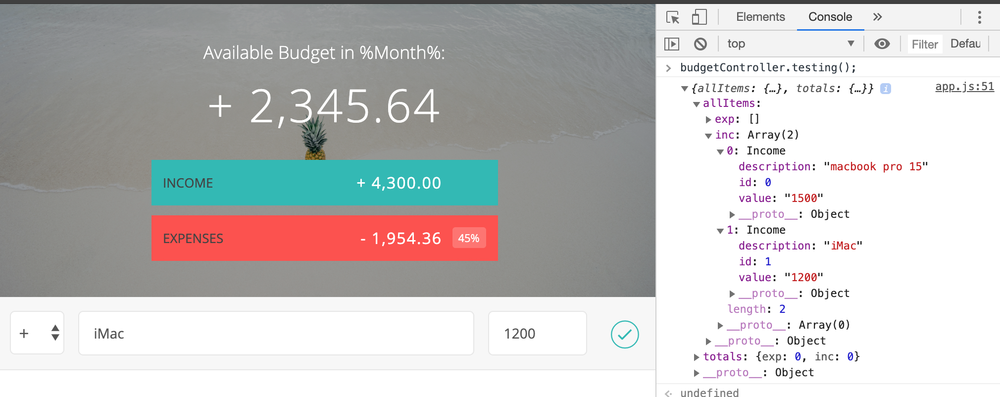

# Updating to the newest version
```js
// Budget Controller
var budgetController = (function () {
    var Expense = function (id, description, value) {
        this.id = id;
        this.description = description;
        this.value = value;
    };
    var Income = function (id, description, value) {
        this.id = id;
        this.description = description;
        this.value = value;
    };

    var data = {
        allItems: {
            exp: [],
            inc: []
        },
        totals: {
            exp: 0,
            inc: 0
        }
    }

    return {
        addItem: function (type, des, val) {
            var newItem, ID;

            // Create new ID
            if (data.allItems[type].length > 0) {
                ID = data.allItems[type][data.allItems[type].length - 1].id + 1;
            } else {
                ID = 0;
            }

            // Create new item based on 'inc' or 'exp' type
            if (type === 'exp') {
                newItem = new Expense(ID, des, val);
            } else if (type === 'inc') {
                newItem = new Income(ID, des, val);
            }

            // Push it into ouer data structure
            data.allItems[type].push(newItem);

            // Return the new element
            return newItem;
        },

        testing: function () {
            console.log(data);
        }
    }


})();

// UI Controller
var UIController = (function () {
    var DOMstrings = {
        inputType: '.add__type',
        inputDescription: 'add__description',
        inputValue: 'add__value',
        inputBtn: '.add__btn',
        incomeContainer: 'income__list',
        expensesContainer: 'expenses__list'
    };

    return {
        getInput: function () {
            return {
                type: document.querySelector(DOMstrings.inputType).value, //will be either inc or exp
                description: document.getElementsByClassName(DOMstrings.inputDescription)[0].value,
                value: document.getElementsByClassName(DOMstrings.inputValue)[0].value
            };
        },

        addListItem: function (obj, type) {
            var html, newHtml, element;
            // Create HTML strin with placeholder text

            if (type === 'inc') {
                element = DOMstrings.incomeContainer;
                html = '<div class="item clearfix" id="income-%id%">\
                <div class="item__description">%description%</div>\
                <div class="right clearfix">\
                    <div class="item__value">%value%</div>\
                    <div class="item__delete">\
                        <button class="item__delete--btn"><i class="ion-ios-close-outline"></i></button>\
                    </div>\
                </div>\
            </div>';
            } else if (type === 'exp') {
                element = DOMstrings.expensesContainer;
                html = '<div class="item clearfix" id="expense-%id%">\
                <div class="item__description">%description%</div>\
                <div class="right clearfix">\
                    <div class="item__value">%value%</div>\
                    <div class="item__percentage">21%</div>\
                    <div class="item__delete">\
                        <button class="item__delete--btn"><i class="ion-ios-close-outline"></i></button>\
                    </div>\
                </div>\
            </div>';
            }

            // Replace the placeholder text with some actual data
            newHtml = html.replace('%id', obj.id);
            newHtml = newHtml.replace('%description%', obj.description);
            newHtml = newHtml.replace('%value%', obj.value);

            // Insert the HTML inot the DOM
            document.getElementsByClassName(element)[0].insertAdjacentHTML('beforeend', newHtml);
        },

        getDOMstrings: function () {
            return DOMstrings;
        }
    };
})();

// Global App Controller
var controller = (function (budgetCtrl, UICtrl) {

    var setupEventListeners = function () {
        var DOM = UICtrl.getDOMstrings();
        document.querySelector(DOM.inputBtn).addEventListener('click', ctrlAddItem);
        document.addEventListener('keypress', function (event) {
            if (event.keyCode === 13 || event.which === 13) {
                ctrlAddItem();
            }
        });
    };

    var ctrlAddItem = function () {
        var input, newItem;

        // 1. Get the filed input data
        input = UICtrl.getInput();

        // 2. Add the item to the budget controller
        newItem = budgetCtrl.addItem(input.type, input.description, input.value);

        // 3. Add the item to the UI
        UICtrl.addListItem(newItem, input.type);

        // 4. Calculate the budget
        // 5. Display the budget on the UI
        console.log("It was working.");
    };

    return {
        init: function () {
            console.log('Application has statred.');
            setupEventListeners();
        }
    };
})(budgetController, UIController);

controller.init();
```
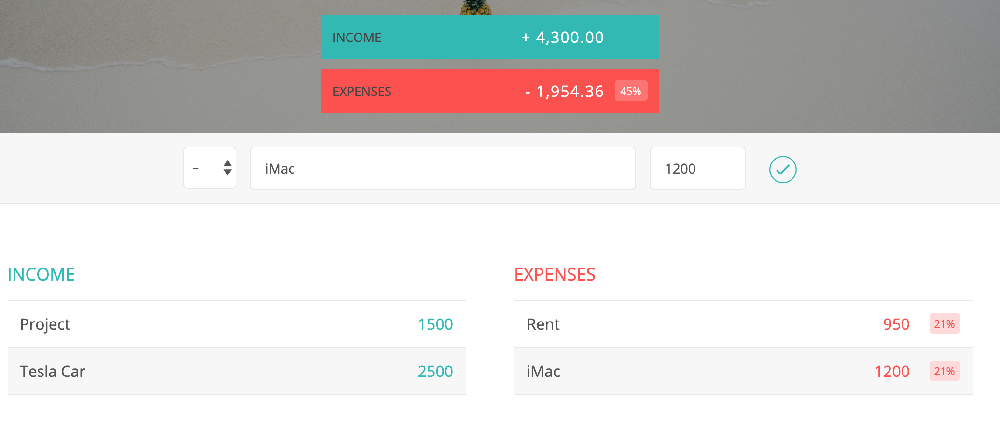


# Clearing input filed
- How to clear HTML field
- How to use querySelectorAll
- How to convert a list to an array
- A better way to loop over an array then for loops: foreach
```js
        clearFields: function () {
            var fields, fieldsArr;
            fields = document.querySelectorAll('.'+DOMstrings.inputDescription + ', ' + '.'+DOMstrings.inputValue);
            fieldsArr = Array.prototype.slice.call(fields);
            fieldsArr.forEach(function (current, index, array) {
                current.value = "";
            });
            fieldsArr[0].focus();
        },
```
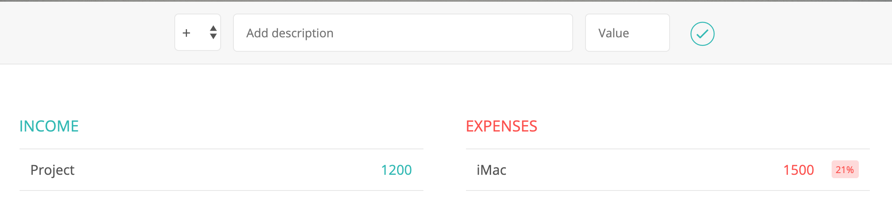


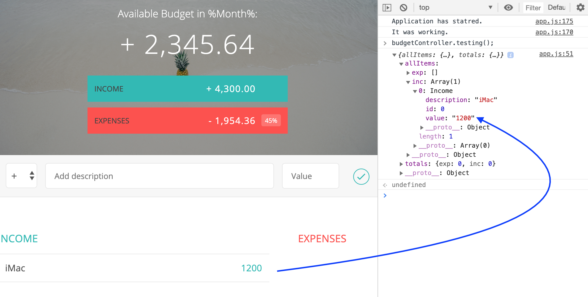
- the data type is still string
- we need to convert to float value
```js
  getInput: function () {
            return {
                type: document.querySelector(DOMstrings.inputType).value, //will be either inc or exp
                description: document.getElementsByClassName(DOMstrings.inputDescription)[0].value,
                value: parseFloat(document.getElementsByClassName(DOMstrings.inputValue)[0].value)
            };
        },
```
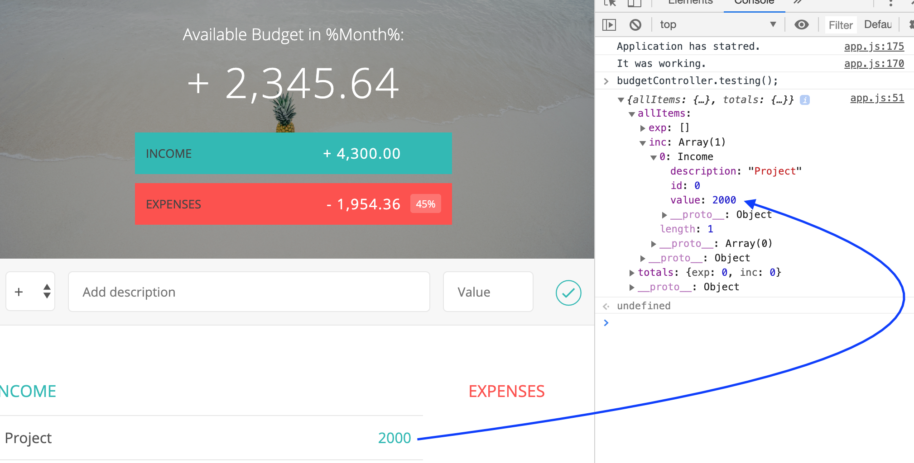


- we still hava a problem, if we click the button without entering any data
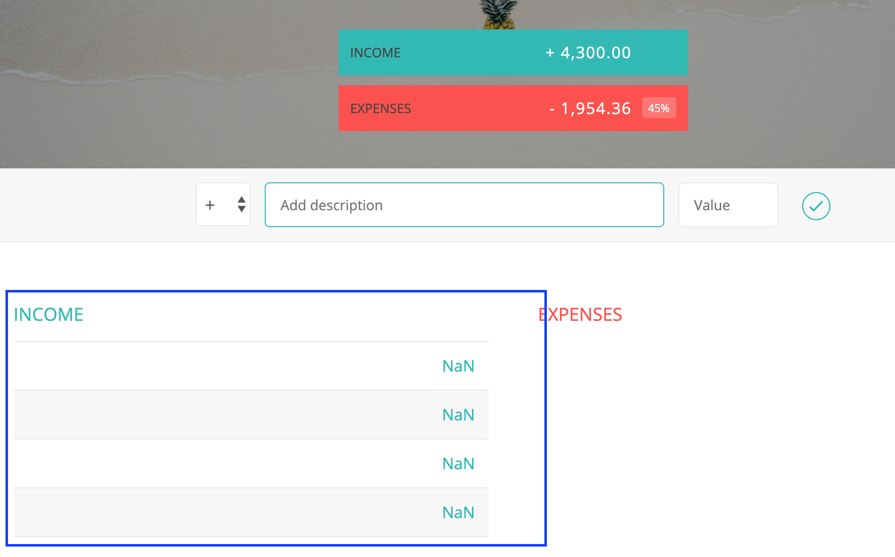

- thus, we adding a if statement
```js
        if (input.description !== "" && !isNaN(input.value) && input.value > 0) {
            // 2. Add the item to the budget controller
            newItem = budgetCtrl.addItem(input.type, input.description, input.value);

            // 3. Add the item to the UI
            UICtrl.addListItem(newItem, input.type);

            // 4. Clear the fields
            UICtrl.clearFields();

            // 5. Calculate and update budget
            updateBudget();
            console.log("It was working.");
        }
```
`Now we have solved this issue`

# How and why to create simple, reusable functions with only one purpose;
# How to sum all elements of an array using the forEach method

- we using .allItems[type] to select a array of either income or expenses
```js
   var calculateTotal = function (type) {
        var sum = 0;
        data.allItems[type].forEach(function (current) {
            // we using .allItems[type] to select a array of either income or expenses
            sum += current.value;
        });
        /* 
        0
        [200, 400, 100]
        sum = 0 + 200
        sum = 200 + 400
        sum = 600 + 100
        */
       data.totals[type] = sum;
    };
```

- updating data structure
```js
    var data = {
        allItems: {
            exp: [],
            inc: []
        },
        totals: {
            exp: 0,
            inc: 0
        },
        budget: 0,
        percentage: -1
        // why set to be -1? because -1 is usually a value that we use to say that something is nonexistent.
    }
```

```js

    var calculateTotal = function (type) {
        var sum = 0;
        data.allItems[type].forEach(function (current) {
            // we using .allItems[type] to select a array of either income or expenses
            sum += current.value;
        });
        /* 
        0
        [200, 400, 100]
        sum = 0 + 200
        sum = 200 + 400
        sum = 600 + 100
        */
       data.totals[type] = sum;
    };

        calculateBudget: function () {
            // calculate total income and expenses
            calculateTotal('exp');
            calculateTotal('inc');

            // calculate the budget: income - expenses
            data.budget = data.totals.inc - data.totals.exp;

            // calculate the percentage of income that we spent
            if(data.totals.inc > 0){
                data.percentage = Math.round(data.totals.exp / data.totals.inc * 100);
                //if first time, you didn't enter the income
            }else{
                data.percentage = -1;
                //if first time, you didn't enter the income
            }

            //Expense = 100 and income 200, spent 50% = 100/200 = 0.5 * 100
        },

        getBudget: function(){
            return {
                budget: data.budget,
                totalInc: data.totals.inc,
                totalExp: data.totals.exp,
                percentage: data.percentage
            }
        },
```
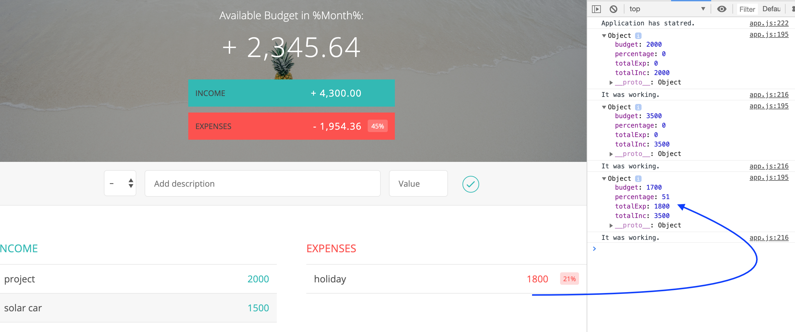
---


# Partice DOM manipulation by updating the budget and total values

`Updating UIController`
```js
    var DOMstrings = {
        inputType: '.add__type',
        inputDescription: 'add__description',
        inputValue: 'add__value',
        inputBtn: '.add__btn',
        incomeContainer: 'income__list',
        expensesContainer: 'expenses__list',
        budgetLabel: 'budget__value',
        incomeLabel: 'budget__income--value',
        expensesLabel: 'budget__expenses--value',
        percentageLabel: 'budget__expenses--percentage'
    };

        displayBudget: function(obj){
            document.getElementsByClassName(DOMstrings.budgetLabel)[0].textContent = obj.budget;
            document.getElementsByClassName(DOMstrings.incomeLabel)[0].textContent = obj.totals.inc;
            document.getElementsByClassName(DOMstrings.expensesLabel)[0].textContent = obj.totalExp;
            if(obj.percentage > 0){
                document.getElementsByClassName(DOMstrings.percentageLabel)[0].textContent = obj.percentage + "%";
            }else{
                document.getElementsByClassName(DOMstrings.percentageLabel)[0].textContent = "---";
            }
        },
```

`Updating controller`
```js
    var updateBudget = function () {
        //1. calculate the budget
        budgetCtrl.calculateBudget();

        //2. Return the budget
        var budget = budgetCtrl.getBudget();

        //5. Display the budget on the UI
        UICtrl.displayBudget(budget);
    }
```
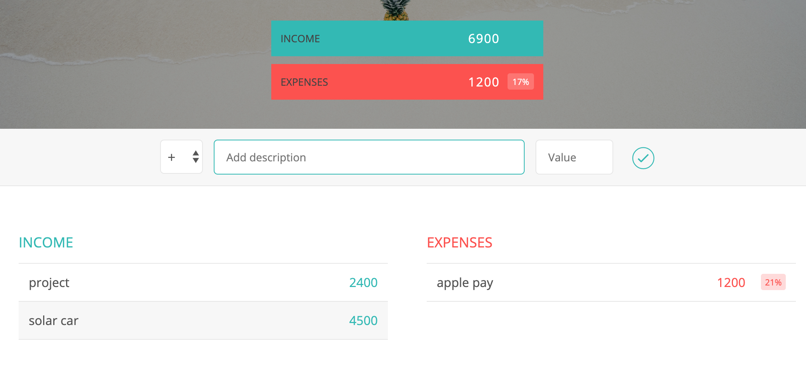

`Updating init`
```js
        init: function () {
            console.log('Application has statred.');
            UICtrl.displayBudget({
                budget: 0,
                totalInc: 0,
                totalExp: 0,
                percentage: -1
            });
            setupEventListeners();
        }
```
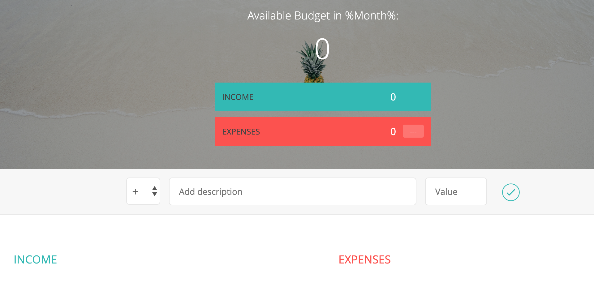
---


****************************************** Part Two *******************************************

# So far, the framework have been done, next step two

`Setting up the Delete Event Listener Using Event Delegation`

`Updating DOMstrings`
```js
    var DOMstrings = {
        inputType: '.add__type',
        inputDescription: 'add__description',
        inputValue: 'add__value',
        inputBtn: '.add__btn',
        incomeContainer: 'income__list',
        expensesContainer: 'expenses__list',
        budgetLabel: 'budget__value',
        incomeLabel: 'budget__income--value',
        expensesLabel: 'budget__expenses--value',
        percentageLabel: 'budget__expenses--percentage',
        container: 'container'
    };
```
`Updating setupEventListeners`
```js
    var setupEventListeners = function () {
        var DOM = UICtrl.getDOMstrings();
        document.querySelector(DOM.inputBtn).addEventListener('click', ctrlAddItem);
        document.addEventListener('keypress', function (event) {
            if (event.keyCode === 13 || event.which === 13) {
                ctrlAddItem();
            }
        });

        document.getElementsByClassName(DOM.container)[0].addEventListener('click', ctrlDeleteItem);
    };
```
`implementing ctrlDeleteItem function`
```js
    var ctrlDeleteItem = function(event){
        console.log(event.target);
    };
```


`when we click the button`
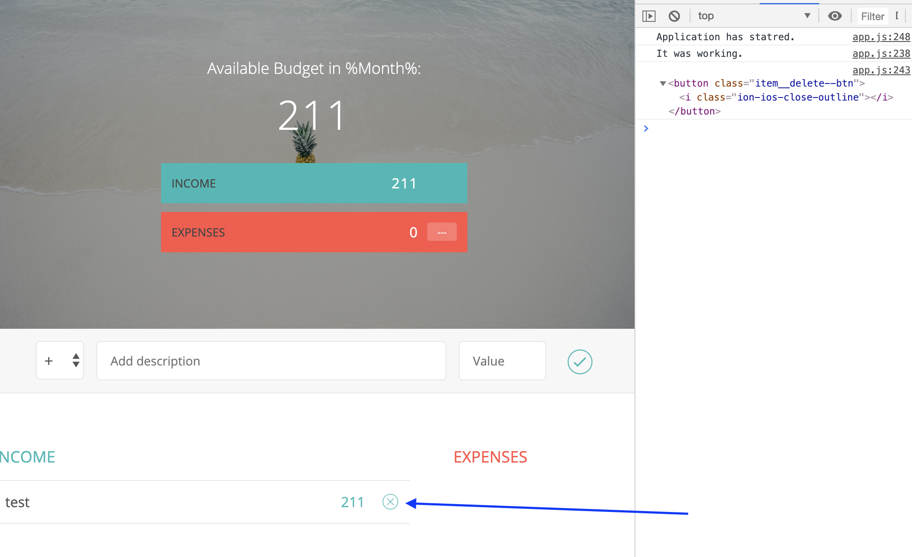
```html
                        <div class="item clearfix" id="income-0">
                            <div class="item__description">Salary</div>
                            <div class="right clearfix">
                                <div class="item__value">+ 2,100.00</div>
                                <div class="item__delete">
                                    <button class="item__delete--btn">
                                        <i class="ion-ios-close-outline"></i>
                                    </button>
                                </div>
                            </div>
                        </div>
```

- So we don't want to just move up to the button, but in fact we want to move up all the way 
to the income, we need to use the parent node property for times, and we can actually do that.
```js
    var ctrlDeleteItem = function (event) {
        console.log(event.target.parentNode.parentNode.parentNode.parentNode);
    };
```
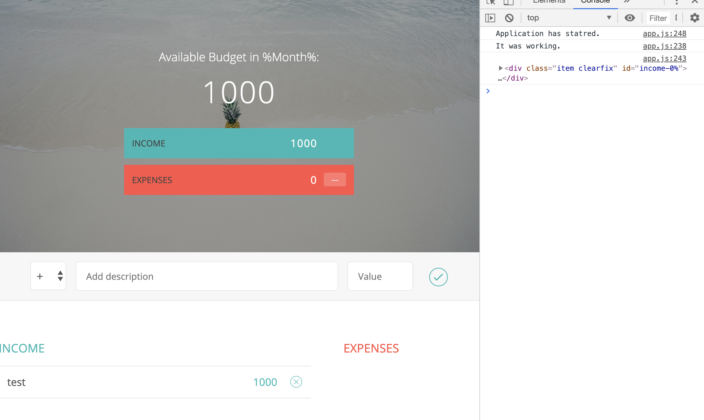

`updating to parentNode's id`
```js
    var ctrlDeleteItem = function (event) {
        console.log(event.target.parentNode.parentNode.parentNode.parentNode.id);
    };
```


# Another method to loop over an array: map;
# How to remove elements from an array using the splice method

`adding a delete method`
```js
        deleteItem: function (type, id) {
            var ids, index;
            // id = 6
            //data.allItems[type][id];
            //ids = [1 2 4 6 8]
            //index = 3

            ids = data.allItems[type].map(function (current) {
                return current.id;
            });
            index = ids.indexOf(id);

            if (index !== -1) {
                data.allItems[type].splice(index, 1);
            }
        },

// array.splice(index, howmany, item1, ....., itemX)
//howmany	Optional. The number of items to be removed. If set to 0, no items will be removed
```

`Inside the controller`
```js
    var ctrlDeleteItem = function (event) {
        var itemID, splitID, type, ID;
        itemID = event.target.parentNode.parentNode.parentNode.parentNode.id;
        if (itemID) {
            //inc-1
            splitID = itemID.split('-');
            type = splitID[0];
            ID = parseInt(splitID[1]);

            //1. delete the item from the data structure
            budgetCtrl.deleteItem(type, ID);
            //2. Delete the item from the UI

            //3. Update and show the new budget
        }
    };
```
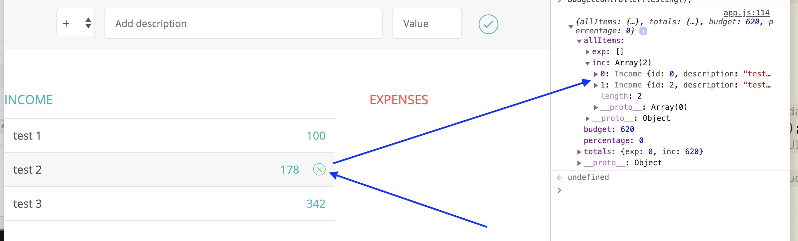

`adding a deleteListItem function into UIController`
```js
        deleteListItem: function (selectorID) {
            var el = document.getElementById(selectorID);
            el.parentNode.removeChild(el);
        },
```

`updating the controller`
```js
    var ctrlDeleteItem = function (event) {
        var itemID, splitID, type, ID;
        itemID = event.target.parentNode.parentNode.parentNode.parentNode.id;
        if (itemID) {
            //inc-1
            splitID = itemID.split('-');
            type = splitID[0];
            ID = parseInt(splitID[1]);

            //1. delete the item from the data structure
            budgetCtrl.deleteItem(type, ID);

            //2. Delete the item from the UI
            budgetCtrl.deleteListItem(itemID);

            //3. Update and show the new budget
            updateBudget();

        }
    };
```

---


****************************************** Part Three *******************************************


