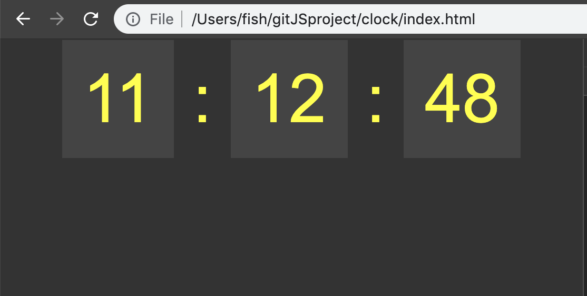

### `create a html`

```html
<!DOCTYPE html>
<html lang="en">
    <head>
        <meta charset="UTF-8">
        <title>clock</title>
        <style>
            body{
                background: #333;
            }
            .clock{
                font-size: 4em;
                text-align: center;
                margin: 20px auto;
                color: yellow;
                font-family: arial;
            }
            .clock span{
                padding: 20px;
             background: #444;   
            }
        </style>
    </head>

    <body>
        <div class="clock"></div>
    </body>
    
    <script src="sandbox.js"></script>
</html>
```
`sandbox.js`
```js
const clock = document.getElementsByClassName('clock')[0];

const tick = () => {
    const now = new Date();

    const hr = now.getHours();
    const min = now.getMinutes();
    const sec = now.getSeconds();

    const html = `
    <span>${hr}</span> :
    <span>${min}</span> :
    <span>${sec}</span> 
    `;

    clock.innerHTML = html;
};

setInterval(tick, 1000);
```


