# This project to practice more with jQuery method and css 
### jQuery
- .on
- .keypress
- .fade
- .Slide
- .Selecting

### css
- margin
- Padding
- Float
- Fonts

# New Things!
### jQuery
- .parent()
- .append()
- Creating Elements
- Event Delegation

### CSS
- Font-Awesome
- Box-Shadow
- Transition
- Gradients

1. firstly, import jQuery library and .css
```html
<link rel="stylesheet" href="assets/css/todos.css">
<script src="assets/js/lib/jquery-3.4.1.slim.min.js"></script>
/* 
jQuery
ƒ (e,t){return new E.fn.init(e,t)}
$('body')
E.fn.init [body, prevObject: E.fn.init(1)]
 */
```

1. create a new html
```html
<!DOCTYPE html>
<html lang="en">
<head>
    <title>Todo List</title>
    <link rel="stylesheet" href="assets/css/todos.css">
    <script src="assets/js/lib/jquery-3.4.1.slim.min.js"></script>
</head>
<body>
    
    <div id="container">
        <h1>Fron-End To-do List</h1>
        <input type="text">

        <ul>
            <li><span>X</span> Learning Html</li>
            <li><span>X</span> Learning CSS</li>
            <li><span>X</span> Html5 CSS3</li>
        </ul>
    </div>
    <script src="assets/js/todos.js"></script>
</body>
</html>
```
- adding css style
```css
#container{
    width: 360px;
    margin: 0 auto;
    border: 2px solid gray;
}
```


```js
// Check off specific Todos by checking
$('li').click(function(){
    $(this).css('color', 'gray');
    $(this).css('text-decoration', 'line-through');
});
```
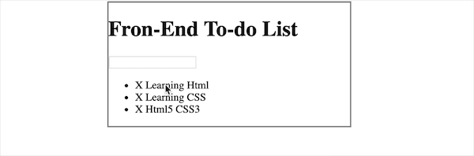

---
```js
$('li').click(function(){
    //if li is gray; 
    if($(this).css('color') === 'gray'){
        //return it black
        console.log('It is currently gray!');
    }
    //else
        
    $(this).css({
        color: 'gray',
        textDecoration: 'line-through'
    });
});
```

- we can see 'console.log('It is currently gray!');' doesn't work
- since the color is not gray.
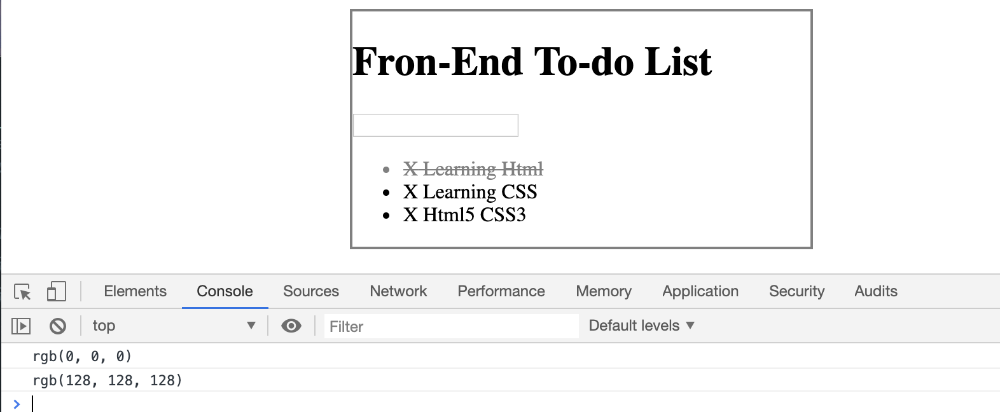
- when we click the 'li', it shows rgb(0, 0, 0).
- that means the color is not gray
- when we secondly click the 'li', it shows rgb(128, 128, 128). This is its color
- Therefore, we need to compare the color
```js
$('li').click(function(){
    //if li is gray; 
    if($(this).css('color') === 'rgb(128, 128, 128)'){
        //return it black
        console.log('It is currently gray!');
    }
    //else
        
    $(this).css({
        color: 'gray',
        textDecoration: 'line-through'
    });
});
```
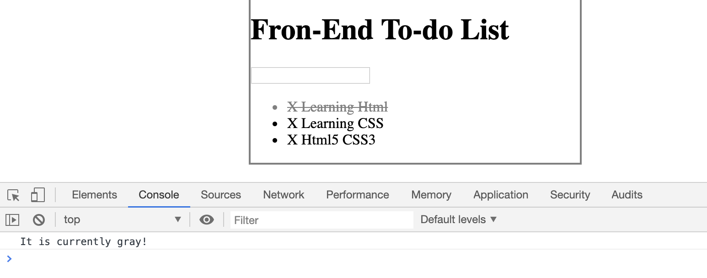

- Now, we still need to make a some improvement so that it can implement 
that functioning: toggle from gray to black
```js
$('li').click(function(){
    //if li is gray; 
    if($(this).css('color') === 'rgb(128, 128, 128)'){
        //return it black
        $(this).css({
            color: 'black',
            textDecoration: 'none'
        });
    } 
    else{  //else    
        //return it gray
        $(this).css({
            color: 'gray',
            textDecoration: 'line-through'
        });
    }
});
```
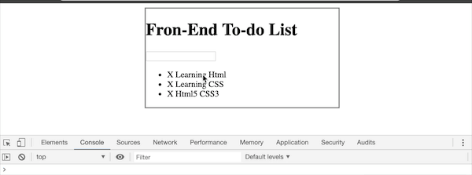

---
- So far so good! We can use jQuery's toggle function to implement simply.
1. adding a class into todos.css
```css
.completed{
    color:gray;
    text-decoration: line-through; 
}
```
2. using toggle() function
```js
$('li').click(function(){
    $(this).toggleClass('completed');
});
```
- the above function can also implement this functioning:


---
# Deleting todolist
- Click on x to delete todo
```js
$('span').click(()=>{
    alert('clicked on a span!')
})
```


- we can add some function
```js
$('ul').click(()=>{
    alert('clicked on an ul!')
})

$('#container').click(()=>{
    alert('clicked on a container div!')
})

$('body').click(()=>{
    alert('clicked on body!')
})
```
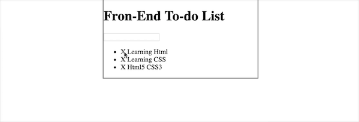

- However, we still can stop propagating
```js
$('span').click((event)=>{
    alert('clicked on a span!');
    event.stopPropagation();
});
```


- now we try to delete span
```js
$('span').click(function(event){
    $(this).remove();
    event.stopPropagation();
});
```
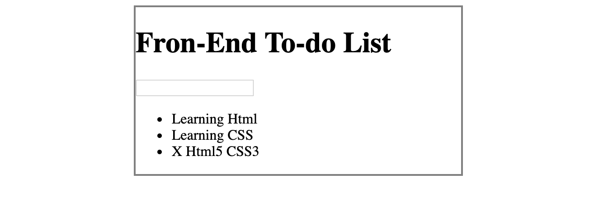
- however, the problem is that we just remove the span;
we need to delete the whole line
- so we call the parent()
```js
$('span').click(function(event){
    $(this).parent().remove();
    event.stopPropagation();
});
```
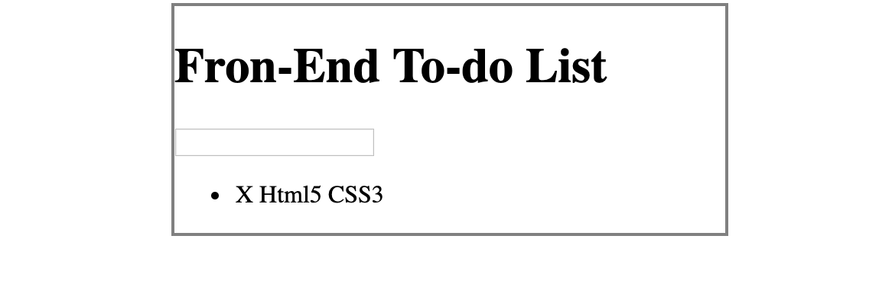

- we try to use fadeOut() function and binding a callback function
```js
$('span').click(function(event){
    $(this).parent().fadeOut(500, ()=>{
        $(this).remove();
    });
    event.stopPropagation();
});
```


# keypress  .which
```js
$("input[type='text']").keypress( (event)=> {
    if(event.which === 13){
        console.log('You hit enter!');
    }
});
```
- when hit the enter
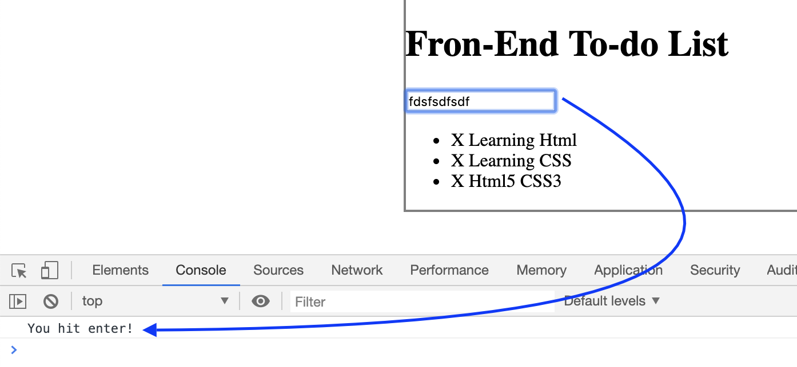


---
- binding the value after keypress event
```js
$("input[type='text']").keypress( function(event){
    if(event.which === 13){
        console.log($(this).val());
    }
});
```
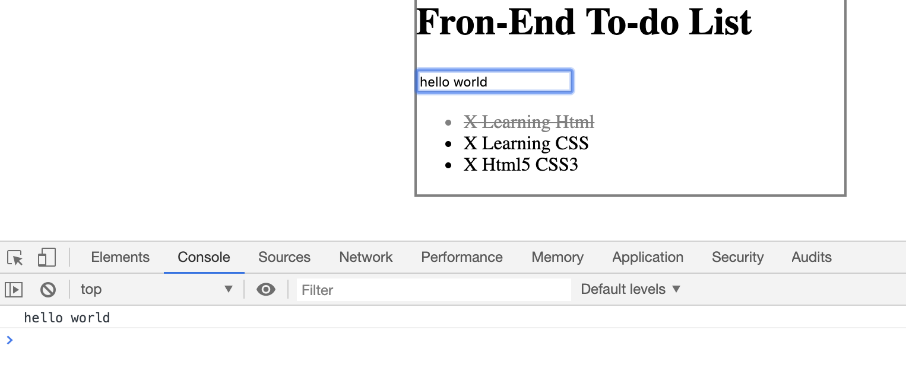

---
```js
$("input[type='text']").keypress( function(event){
    if(event.which === 13){
        //grabbing new todo text from input
        var todoText = $(this).val();
        //create a new li and add to ul
        $('ul').append('<li>' + todoText + '</li>');
    }
});
```
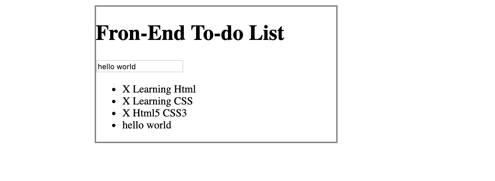
- but the 'hello world' still keep in input textfiled
- we need to add a statement
```js
$("input[type='text']").keypress( function(event){
    if(event.which === 13){
        //grabbing new todo text from input
        var todoText = $(this).val();
        $(this).val('');
        //create a new li and add to ul
        $('ul').append('<li><span>X</span> ' + todoText + '</li>');
    }
});
```
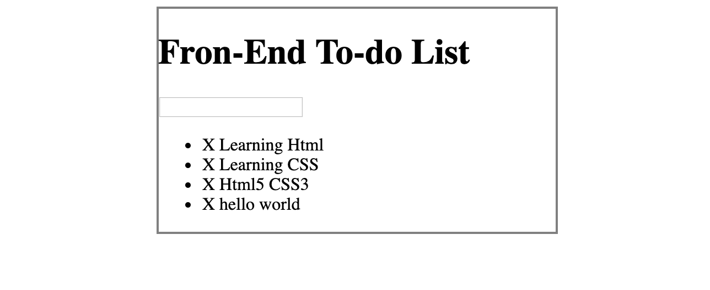
- the problem is that we cannot delete the new line, because click() and on()
are different.

# Why use on()?
- **In most case, click() and on('click') will both get the job done.**
**However, there is one key difference:**
1. **click() only adds listeners for existing elements**
2. **on() will add listeners for all potenital future elements**

- so we change the click() function to on()
```js
$('ul').on('click', 'li', function(){
    $(this).toggleClass('completed');
});

$('ul').on('click', 'span', function(event){
    $(this).parent().fadeOut(500, function(){
        $(this).remove();
    });
    event.stopPropagation();
});
```


---
# Now we change the css 
```css
h1{
    background: #2980b9;
    color: white;
    margin: 0;
    padding: 10px 20px;
    /* text-transform: uppercase; */
    font-size: 24px;
    font-weight: normal;
}
#container{
    width: 360px;
    margin: 100px auto;
    background: #f7f7f7;
    box-shadow: 0 0 3px rgba(0, 0, 0, 0.1);
    /* more box-shadow css, we can google box-shadow mdn */
}
```
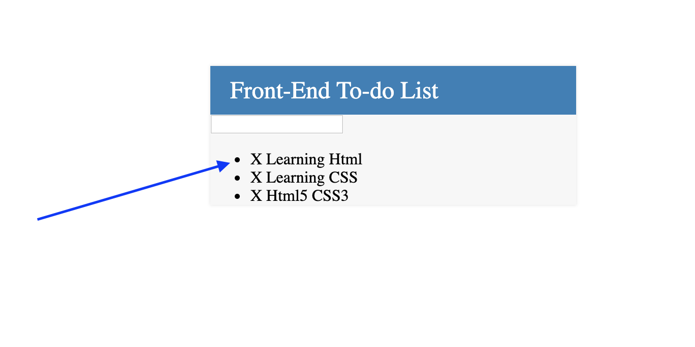
- but we still have bullet points, the next thing we want to tackle is getting
rid of these bullet points.  
```css
ul{
    list-style: none;
}
```
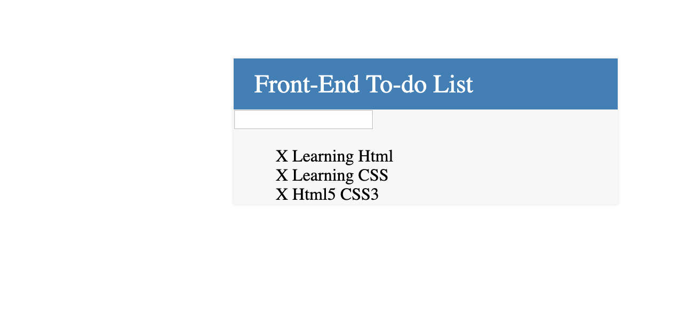

---
- now we google fonts, pick regular 400, medium 500, and bold 700.
```html
<link href="https://fonts.googleapis.com/css?family=Roboto:400,500,700&display=swap" rel="stylesheet">
```
- change the li 's background color
```css
li{
    background: #fff;
    height: 40px;
    line-height: 40px;
    color: #666;
} 
li:nth-child(2n){
    background: #f7f7f7;
}
```
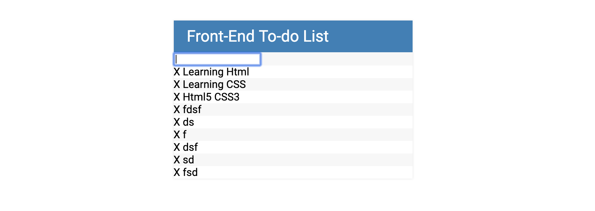

- change input style
```css
input{
    font-size: 18px;
    color: #2980b9;
    background-color: #f7f7f7;
    width: 100%;
    padding: 13px 13px 13px 20px;
    box-sizing: border-box;
}
input:focus{
    background: #fff;
    border: 3px solid #2980b9;
}
```
```html
<input type="text" placeholder="Add New Todo"> 
```
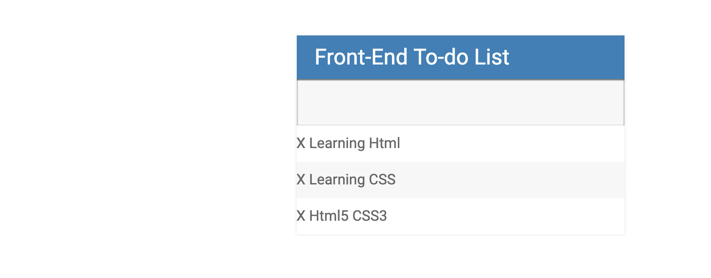

- download css code for background
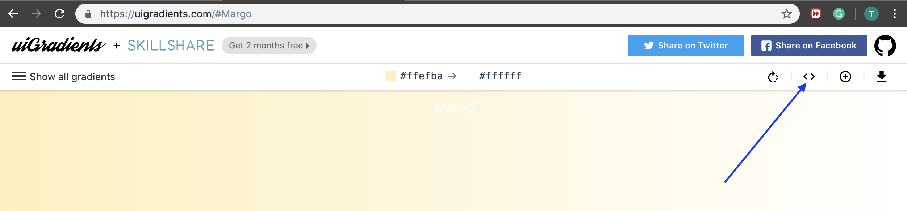
```css
background: #FFEFBA;  /* fallback for old browsers */
background: -webkit-linear-gradient(to right, #FFFFFF, #FFEFBA);  /* Chrome 10-25, Safari 5.1-6 */
background: linear-gradient(to right, #FFFFFF, #FFEFBA); /* W3C, IE 10+/ Edge, Firefox 16+, Chrome 26+, Opera 12+, Safari 7+ */
```
- google 'fontawesome cdn'; updating the html
```html
<head>
    <title>Todo List</title>
    <link rel="stylesheet" href="assets/css/todos.css">
    <link href="https://fonts.googleapis.com/css?family=Roboto:400,500,700&display=swap" rel="stylesheet">
    <link rel="stylesheet" type="text/css" href="https://cdnjs.cloudflare.com/ajax/libs/font-awesome/4.4.0/css/font-awesome.css">
    <script src="assets/js/lib/jquery-3.4.1.min.js"></script>
</head>
<body>
    <div id="container">
        <h1>Front-End To-do List <i class="fa fa-battery-three-quarters"></i></h1>
        <!-- <i class="fa fa-battery-three-quarters"></i> adding a component icon-->
        <input type="text" placeholder="Add New Todo"> 
        <ul>
            <li><span>X</span> Learning Html</li>
            <li><span>X</span> Learning CSS</li>
            <li><span>X</span> Html5 CSS3</li>
        </ul>
    </div>
    <script src="assets/js/todos.js"></script>
</body>
```
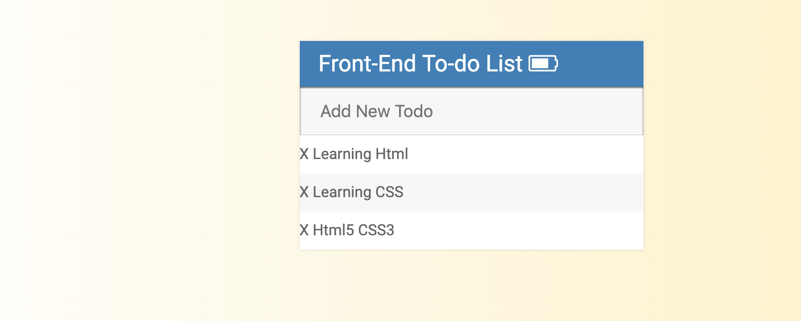

- now change the h1's icon
```html
<h1>Front-End To-do List <i class="fa fa-plus"></i></h1>
```
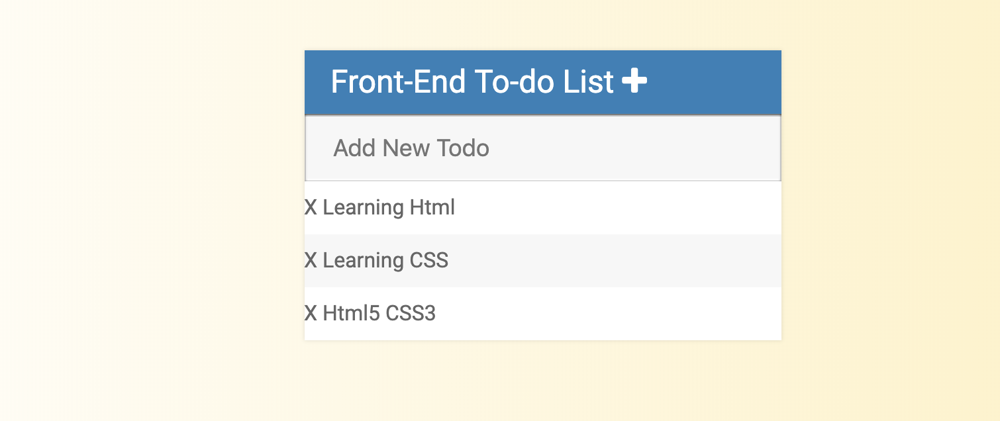

- add css
```css
.fa-plus{
    float: right;
}
```
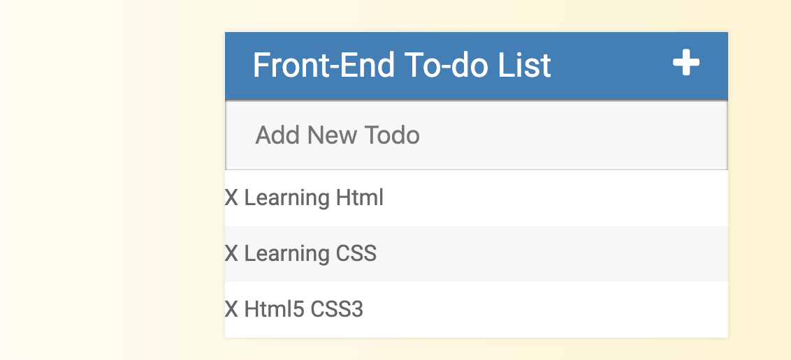

- change span 'X' to trash icon
```html
            <li><span><i class="fa fa-trash"></i></span> Learning Html</li>
            <li><span><i class="fa fa-trash"></i></span> Learning CSS</li>
            <li><span><i class="fa fa-trash"></i></span> Html5 CSS3</li>
```
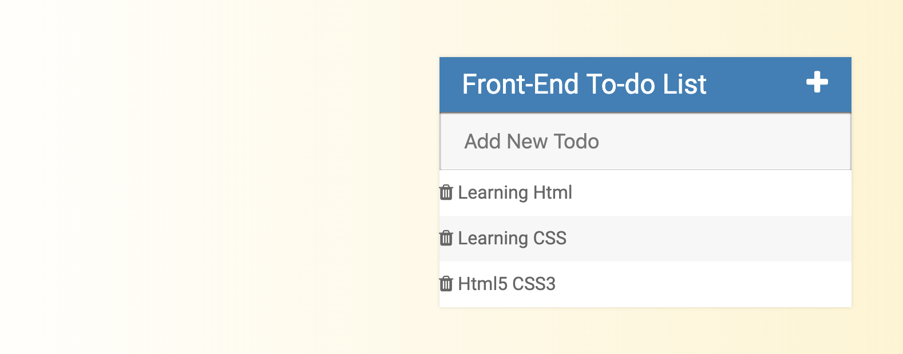

- updating my .js
```js
$("input[type='text']").keypress( function(event){
    if(event.which === 13){
        //grabbing new todo text from input
        var todoText = $(this).val();
        $(this).val('');
        //create a new li and add to ul
        $('ul').append('<li><span><i class="fa fa-trash"></i></span> ' + todoText + '</li>');
    }
});
``` 
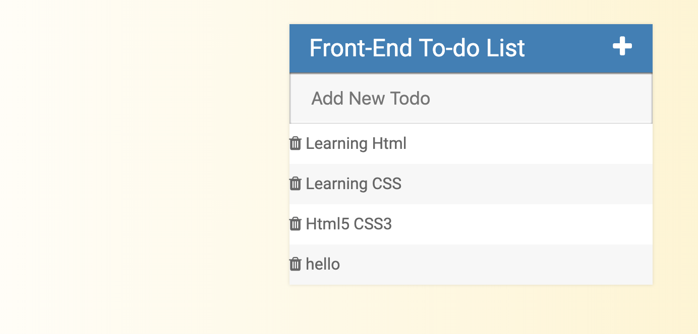

- updating the span element
```css
span{
    background: #e74c3c;
    height: 40px;
    margin-right: 20px;
    text-align: center;
    color:white;
    width: 40px;
    display: inline-block;
}
```
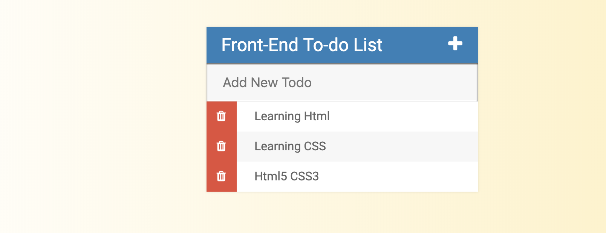

- so far so good, we need to do one more, we hope that we can hide the span. When I move on the span, it will display the trash icon
1. we set the span's width to be 0; adding a li:hover span
2. the span we're going to add transition 0.25 sec  
```css
span{
    background: #e74c3c;
    height: 40px;
    margin-right: 20px;
    text-align: center;
    color:white;
    width: 0;
    display: inline-block;
    transition: 0.25s linear;
    opacity: 0;
}
li:hover span{
    width: 40px;
    opacity: 1.0;
}
```


# finally, we set class fa-plus to be toggle
```js
$('.fa-plus').click(function(){
    $("input[type='text']").fadeToggle();
});
```
- the above codes, will implement the functioning: fade out or fade in
when we click '+', it will fade out, click agian => fade in
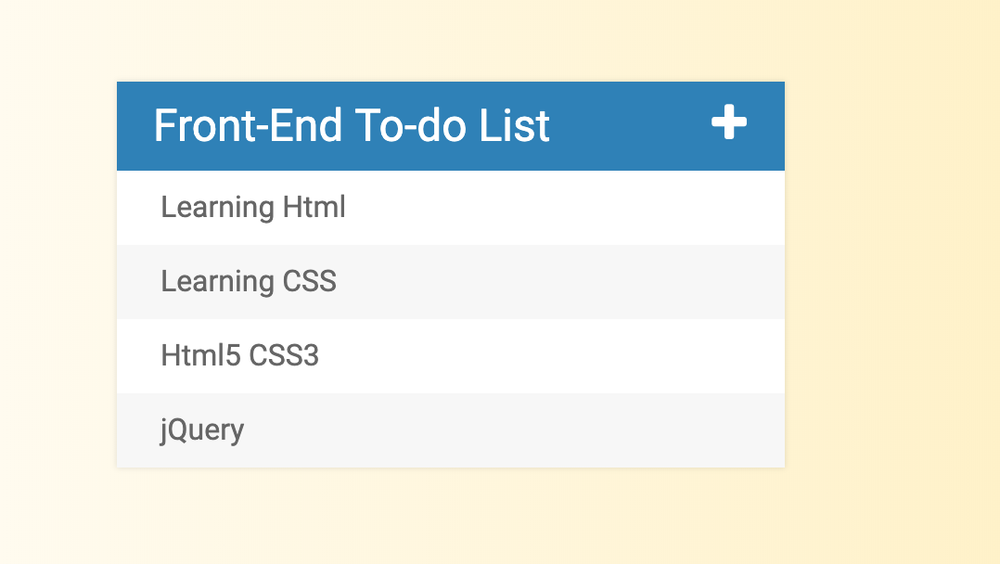


