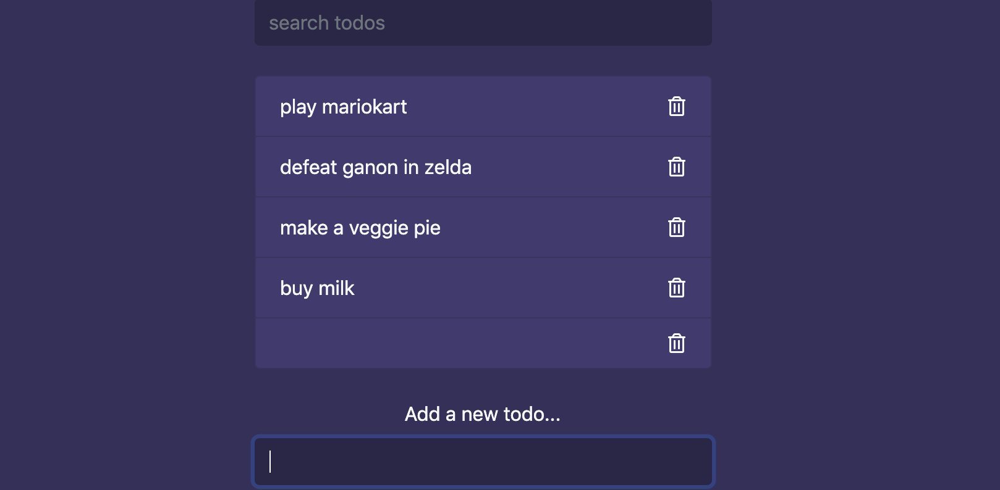

# todolist , a project by using javascript
## downloading the .html .css from github; I just implementing the functioning
1. create .html
2. import bootstrap libray
3. import fontawesome .css
4. creat a our own .css file and app.js

# javascript implementation
- add form's listerner event
```js
addForm[0].addEventListener('submit', e=>{
    e.preventDefault();
    const todo = addForm[0].add.value;
    console.log(todo);
});
```

- the issue is that a space is in fornt of the string, so we can use trim() function
```js
const todo = addForm[0].add.value.trim();
```

- updating the functioning
```js
/* The second way, for example:
const secondWay = document.querySelector('.add');
*/
const addForm = document.getElementsByClassName('add');
const list = document.getElementsByClassName('todos')[0];

const generateTmeplate = (todo) =>{
    const html = `
        <li class="list-group-item d-flex justify-content-between align-items-center">
            <span>${todo}</span>
            <i class="far fa-trash-alt delete"></i>
        </li>
    `;

    list.innerHTML += html;
}


addForm[0].addEventListener('submit', e=>{
    e.preventDefault();
    const todo = addForm[0].add.value.trim();
    
    generateTmeplate(todo);
});
```
1. firstly, we get the ul elment (todos)
2. adding ul's inner contents with a new li element


- but there is still a issue; if we don't add anything, it will add
space into the new line 


- so we adding a if statement
```js
addForm[0].addEventListener('submit', e=>{
    e.preventDefault();
    const todo = addForm[0].add.value.trim(); 
    if(todo.length){
        generateTmeplate(todo);
        addForm.reset();
    }    
});
```

- Now, let's adding a delete event
```js
//delete todos
list.addEventListener('click', e => {
    if(e.target.classList.contains('delete')){
        e.target.parentElement.remove();
    }
});
```


- implementing the search functioning
1. getting a search input element
```js
const search = document.getElementById('search');

//keyup event
search.addEventListener('keyup', ()=>{
    const term = search.value.trim();
    filterTodos(term);
});
```
2. implementing a filterTodos()
```js
const filterTodos = (term) => {
    Array.from(list.children).filter((todo) => { // .filter()  return a array
        return !todo.textContent.includes(term);
    }).forEach((todo) => {
        return todo.classList.add('filtered');
    });

    Array.from(list.children).filter((todo) => { // .filter()  return a array
        return todo.textContent.includes(term);
    }).forEach((todo) => {
        return todo.classList.remove('filtered');
    });
};
```


- now we should add the .filtered 's css style
```css
.filtered{
    display: none !important;
}

/*
we set the display to be none, and it's important  
 */
```

- finally, we testing the search functioning:


- adding a .toLowerCase() to ignore the case-sensitive
```js
const filterTodos = (term) => {
    Array.from(list.children).filter((todo) => { // .filter()  return a array
        return !todo.textContent.toLowerCase().includes(term);
    }).forEach((todo) => {
        return todo.classList.add('filtered');
    });

    Array.from(list.children).filter((todo) => { // .filter()  return a array
        return todo.textContent.toLowerCase().includes(term);
    }).forEach((todo) => {
        return todo.classList.remove('filtered');
    });
};

//keyup event
search.addEventListener('keyup', ()=>{
    const term = search.value.trim().toLowerCase();
    filterTodos(term);
});
```


