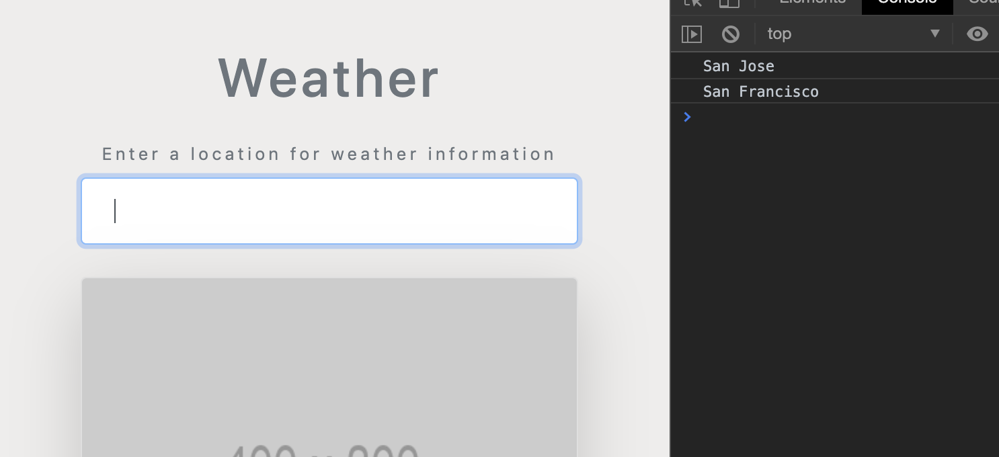
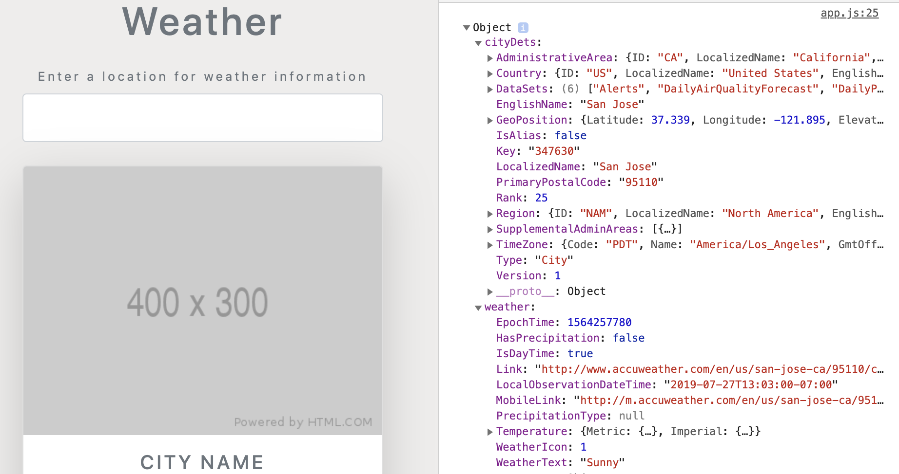
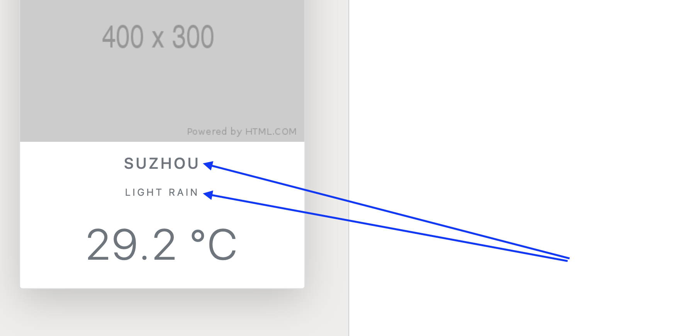
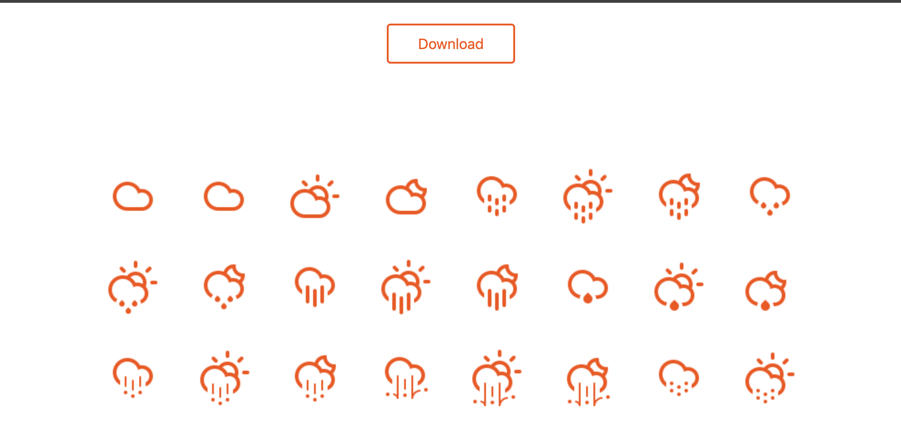
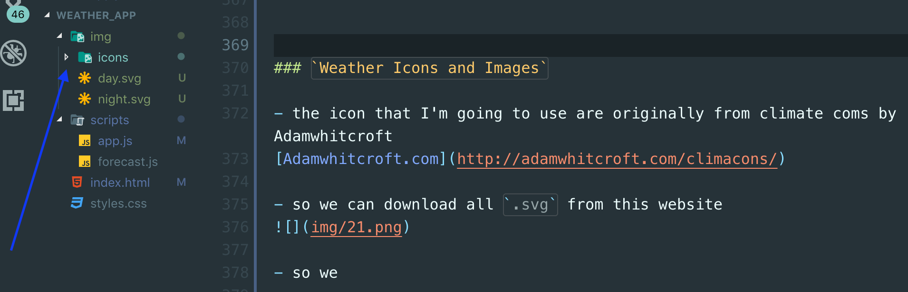
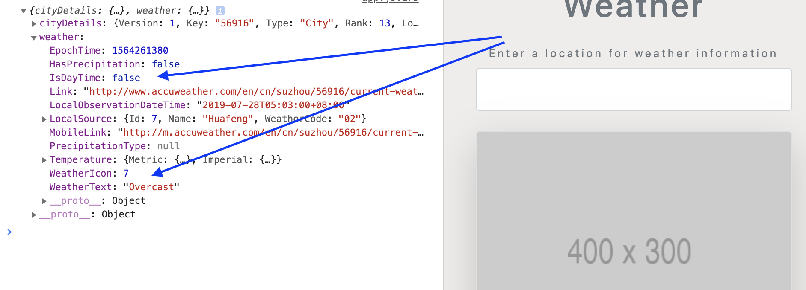
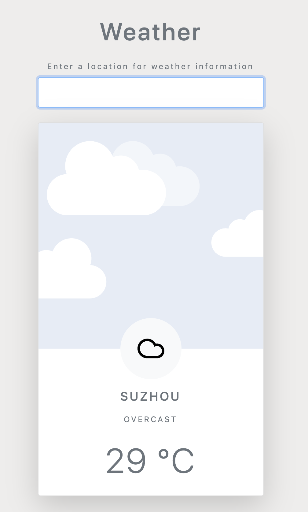

 ### `Weather App`

- this project using the UI design(.html) from `https://github.com/iamshaunjp/modern-javascript/tree/lesson-100`

 - this app is going to work for any different city 
 - I am going to be using a free weather API called 
[AccuWeather API](https://developer.accuweather.com/)

- this API will basically allow us to query their API endpoints for weather
information which is how we able to display it when we search for a particular location.
- we could be using a mixture of `Asynchronous` techniques 

1. import bootStrap library
```html
 <link rel="stylesheet" href="https://stackpath.bootstrapcdn.com/bootstrap/4.3.1/css/bootstrap.min.css" integrity="sha384-ggOyR0iXCbMQv3Xipma34MD+dH/1fQ784/j6cY/iJTQUOhcWr7x9JvoRxT2MZw1T" crossorigin="anonymous">
```

2. create my styles.css
` <link rel="stylesheet" href="styles.css">`

3. create a forecast.js
4. create a app.js

5. in the html
 - create a `div.container.my-5` which is going to have a class of contain and which is a bootstrap class. It contains everything together inside a central column on the page.

```html
  <div class="container my-5 mx-auto">
    <h1 class="text-muted text-center my-4">Weather</h1>

    <form action="" class="change-location my-4 text-center text-muted">
      <label for="city">Enter a location for weather information</label>
      <input type="text" name="city" class="form-control p-4">
    </form>

    <div class="card shadow-lg rounded">
        <!-- inside this div first of all we need some kind of image at the top And this image is ultimately going to be a picture of the day or the night. 
        They will be dynamically injected dependent on the tiem of the city we look up if it's nighttime we're goint to show the night image; if it's in daytime we're going to show the day image
        -->
    </div>
  </div>
```
- So now we need some kind of place holder image instead. To do that, I'm going to use a website called:
[Placeholder.com](https://placeholder.com/)

```html
    <div class="card shadow-lg rounded">
      
    </div>
```

- inside `div.card.shadow-lg.rounded`
- typing `div.icon.bg-light.mx-auto.text-center`
- typing `icon bg-light mx-auto text-center`

`updting our html`

- set our .css styles
```css
body{
  background: #eeedec;
  letter-spacing: 0.2em;
  font-size: 0.8em;
}
.container{
  max-width: 400px;
}
```
- now we can use the accuweather's APIs


- but we need to `sign up` a account

- **Note:** this is the same weather we use the AQ weather API or the `Twitter` API or the `insagram` API

- after login


- `click` MY APPS


- add a new app


- now we get the `API key`


- so we need to copy `API key` ... (I keep this key in my account 😄)
- **Note:** we can only have **50** requests per day that means we can make 50 requests to this API to get data per day.

- if I find myself when I am developing that I've used this 50 times in a day to make a request and I can't make anymore
- All I need to do is delete this `app` then go to `add new app ` to create an app agian I'll get a different API key; and in my .js, to change the key in my code and I'll be able to make another 50 requests with that key. 


- Now when we're requesting data from the end points to this API, we're going to have to do two different things:
    1. firstly, we need to make a request to a certain end point to get city infromation and in that city infromation is going to be a city code. 
    2. Once we have that we're going to use that city code to make a second request to a weather conditions API endpoints. We will send that city code to it so it can identify where we want to get the weather.


### How do we know what those end points are?
   - typically when we have some kind of API service for developers they give us an `API reference`  


- click `API REFERENCE`

- first, we need `Locations API` to get the city => `city search`
- we can do an online testing

- click `Send this request`

- now we have seen this .json data

- past `city search` Resource URL

```js
const key = 'gntDLaihe6vyifm5t6RMlFedA7gNsPj0';

const getCity = async (city) => {
    const URL = 'http://dataservice.accuweather.com/locations/v1/cities/search';
    const query = `?apikey=${key}&q=${city}`;

    const response = await fetch(URL + query);
    const data = await response.json();
    return data[0]; //remember: we return a promise
};

getCity('manchester')
    .then(data => console.log(data))
    .catch(error => console.log(error))
```


- now that means so far we have successfully get the data
- and we get the `city key: "329260"` 


### now we return `API REFERENCE`
- click `Current Conditions API`
- click `Current Conditions`

- we can see the `locationKey`, into which we can put the `city key`

```js
const key = 'gntDLaihe6vyifm5t6RMlFedA7gNsPj0';

//get weather info
const getWeather = async (locationKey) => {
    const URL = 'http://dataservice.accuweather.com/currentconditions/v1/';
    const query = `${locationKey}?apikey=${key}`;

    const response = await fetch(URL + query);
    const data = await response.json();

    console.log(data);
};

getWeather("329260")
```


### `All kind DOM manipulation on app.js`

- first, updating `app.js`
```js
// All kind DOM manipulation
const cityFrom = document.getElementsByTagName('form')[0];

const updateCity = async (city) => {
    console.log(city);
}


cityFrom.addEventListener('submit', (e) => {
    //prevent default action
    e.preventDefault();

    //get city value
    const city = cityFrom.city.value.trim();
    cityFrom.reset();

    //update the ui with new city
    updateCity(city);
})
```



---
`updating app.js`
```js
// All kind DOM manipulation
const cityFrom = document.getElementsByTagName('form')[0];

const updateCity = async (city) => {
    const tempCityDets = await getCity(city);
    const tempWeather = await getWeather(tempCityDets.Key);

    return {
        cityDets: tempCityDets,
        weather: tempWeather
    };
}


cityFrom.addEventListener('submit', (e) => {
    //prevent default action
    e.preventDefault();

    //get city value
    const city = cityFrom.city.value.trim();
    cityFrom.reset();

    //update the ui with new city
    updateCity(city)
        .then(data => console.log(data))
        .catch(error => console.log(error));
})
```

- we can see the object have been returned: 
```js
{
    cityDets: tempCityDets,
    weather: tempWeather
}
```

###  `Shorthand Notation(简化符号)`
```js
const updateCity = async (city) => {
    const cityDetails = await getCity(city);
    const weather = await getWeather(cityDetails.Key);

    return { cityDetails, weather };//shorthand notation
}
```


### `Updating the UI`

- first, we updating `index.html`
```html
<body>
  <div class="container my-5 mx-auto">
    <h1 class="text-muted text-center my-4">Weather</h1>

    <form action="" class="change-location my-4 text-center text-muted">
      <label for="city">Enter a location for weather information</label>
      <input type="text" name="city" class="form-control p-4">
    </form>

    <div class="card shadow-lg rounded d-none">
      
      <div class="icon bg-light mx-auto text-center">
        
      </div>
      <div class="text-muted text-uppercase text-center detail">
        <h5 class="my-3">City name</h5>
        <div class="my-3">Weather condition</div>
        <div class="display-4 my-4">
          <span>temp</span>
          <span>&deg;C</span>
        </div>
      </div>
    </div>
  </div>

  <script src="scripts/forecast.js"></script>
  <script src="scripts/app.js"></script>
</body>
```
- to update the html, we add a new class `d-none` for we want to delete it since we hope that it will display nothing when the user loading in frist time


`app.js`
```js
// updating the UI
// All kind DOM manipulation
const cityFrom = document.getElementsByTagName('form')[0];
const card = document.querySelector('.card');
const detatils = document.querySelector('.detail');

const updateUI = (data) => {

    const cityDetails = data.cityDetails;
    const weather = data.weather;

    //update deatils template
    detatils.innerHTML = `
    <h5 class="my-3">${cityDetails.EnglishName}</h5>
    <div class="my-3">${weather.WeatherText}</div>
    <div class="display-4 my-4">
      <span>${weather.Temperature.Metric.Value}</span>
      <span>&deg;C</span>
    </div>
    `;

    //remove the d-none class if present
    if (card.classList.contains('d-none')) {
        card.classList.remove('d-none');
    } //this step's purpose is to present nothing when it is default
}

const updateCity = async (city) => {
    const cityDetails = await getCity(city);
    const weather = await getWeather(cityDetails.Key);

    return { cityDetails, weather };//shorthand notation
}


cityFrom.addEventListener('submit', (e) => {
    //prevent default action
    e.preventDefault();

    //get city value
    const city = cityFrom.city.value.trim();
    cityFrom.reset();

    //update the ui with new city
    updateCity(city)
        .then(data => updateUI(data))
        .catch(error => console.log(error));
})

```



### `Destructuring 解构赋值`
```js
const updateUI = (data) => {

    // const cityDetails = data.cityDetails;
    // const weather = data.weather;

    // destructuring properties
    const { cityDetails, weather } = data;  //Destructuring Properties

    //update deatils template
    detatils.innerHTML = `
    <h5 class="my-3">${cityDetails.EnglishName}</h5>
    <div class="my-3">${weather.WeatherText}</div>
    <div class="display-4 my-4">
      <span>${weather.Temperature.Metric.Value}</span>
      <span>&deg;C</span>
    </div>
    `;

    //remove the d-none class if present
    if (card.classList.contains('d-none')) {
        card.classList.remove('d-none');
    }
}
```


### `Weather Icons and Images`

- the icon that I'm going to use are originally from climate coms by Adamwhitcroft 
[Adamwhitcroft.com](http://adamwhitcroft.com/climacons/) 

- so we can download all `.svg` from this website


- so we create a folder that we download from [Adamwhitcroft.com](http://adamwhitcroft.com/climacons/) 




### `updating app.js final version`
```js
// Destructuring
const cityFrom = document.getElementsByTagName('form')[0];
const card = document.querySelector('.card');
const detatils = document.querySelector('.detail');
const time = document.querySelector('img.time');
const icon = document.getElementById('image');
// const icon = document.querySelector('.icon img');

const updateUI = (data) => {
    // destructuring properties
    const { cityDetails, weather } = data;

    //update deatils template
    detatils.innerHTML = `
    <h5 class="my-3">${cityDetails.EnglishName}</h5>
    <div class="my-3">${weather.WeatherText}</div>
    <div class="display-4 my-4">
      <span>${weather.Temperature.Metric.Value}</span>
      <span>&deg;C</span>
    </div>
    `;

    //update the day/night & icon images
    const iconSrc = `img/icons/${weather.WeatherIcon}.svg`;
    icon.setAttribute('src', iconSrc);

    let timeSrc = null;
    if (weather.IsDayTime) {
        timeSrc = 'img/day.svg';
    } else {
        timeSrc = 'img/night.svg';
    }
    time.setAttribute('src', timeSrc);

    //remove the d-none class if present
    if (card.classList.contains('d-none')) {
        card.classList.remove('d-none');
    }
}

const updateCity = async (city) => {
    const cityDetails = await getCity(city);
    const weather = await getWeather(cityDetails.Key);

    return { cityDetails, weather };//shorthand notation
}


cityFrom.addEventListener('submit', (e) => {
    //prevent default action
    e.preventDefault();

    //get city value
    const city = cityFrom.city.value.trim();
    cityFrom.reset();

    //update the ui with new city
    updateCity(city)
        .then(data => updateUI(data))
        .catch(error => console.log(error));
})

```



